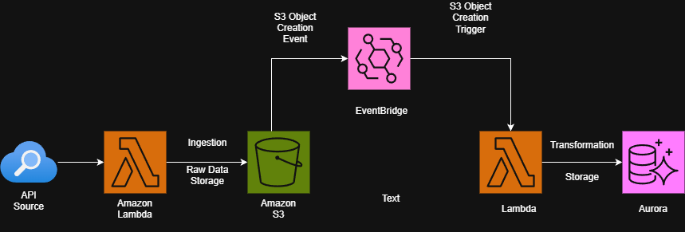

# AGSA Corruption Search & Sentiment Analysis Pipeline

## Overview
This project implements an automated, event-driven data pipeline designed to monitor, ingest, and analyze media articles and social media sentiment related to public sector corruption in South Africa. The system focuses on specific individuals and keywords (e.g., "Corruption", "Fraud") to provide near real-time insights.

## Architecture & Services

The solution leverages a serverless AWS architecture to ensure scalability and operational efficiency.

### 1. Ingestion Layer (AWS Lambda)
*   **Service**: `Tavily Ingestion Lambda` (`tavily_ingestion_lambda.py`)
*   **Role**: Content Discovery & Extraction.
*   **Process**:
    *   Connects to the **Tavily Search API** to fetch curated articles and content.
    *   Filters results based on defined keywords and domain lists (e.g., *News24*, *DailyMaverick*).
    *   Extracts metadata: Titles, URLs, Content, Sentiment Scores.
    *   Saves the raw processed data as JSON files to **Amazon S3**.
*   **Output Path**: `s3://agsa-dev-source-bucket.../tavily_search_results/{Individual_Name}/{Date}/{Timestamp}.json`

### 2. Storage Layer (Amazon S3)
*   **Service**: **Amazon S3**
*   **Role**: Raw Data Lake.
*   **Structure**: Organized hierarchically by `Individual -> Date` to support historical analysis and easy partition-based retrieval.

### 3. Orchestration (Amazon EventBridge)
*   **Service**: **Amazon EventBridge**
*   **Role**: Event-Driven Trigger.
*   **Workflow**:
    *   Detects `Object Created` events in the S3 bucket.
    *   Automatically invokes the **Loader Lambda** with the specific key of the new file.
    *   Ensures that data is processed and loaded into the database immediately upon arrival.

### 4. Loading & Persistence Layer (AWS Lambda & Aurora)
*   **Service**: `Tavily Loader Lambda` (`tavily_loader_lambda.py`)
*   **Role**: ETL & Database Loading.
*   **Process**:
    *   Receives the S3 key from the EventBridge event.
    *   Reads the JSON file from S3.
    *   Performs schema validation and mapping.
    *   Inserts records into **Amazon Aurora PostgreSQL**.
    *   **Deduplication**: Uses `ON CONFLICT` constraints to update existing records instead of creating duplicates.
*   **Database**:
    *   **Instance**: Aurora PostgreSQL (`agsa-dev-db-cluster`)
    *   **Table**: `social_media_articles_test`
    *   **Key Columns**: `url` (Unique Identifier), `individuals_mentioned`, `sentiment_score`, `source`.

## Data Flow Summary
1.  **Search**: Ingestion Lambda runs (Scheduled/Manual) -> Queries External APIs.
2.  **Ingest**: Results are normalized and saved to S3.
3.  **Trigger**: EventBridge detects the new S3 object -> Triggers Loader Lambda.
4.  **Load**: Loader Lambda processes the file -> Updates Aurora Database.

## Key Files
*   [`tavily_ingestion_lambda.py`](./tavily_ingestion_lambda.py): Handles search API integration and S3 upload.
*   [`tavily_loader_lambda.py`](./tavily_loader_lambda.py): Handles S3 reading and Database insertion.
